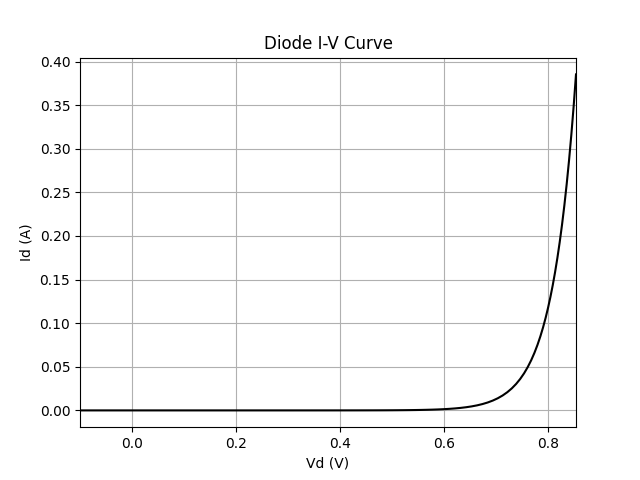
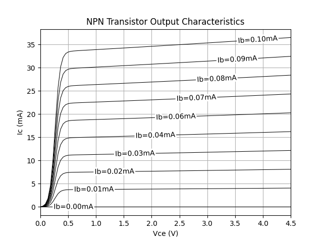
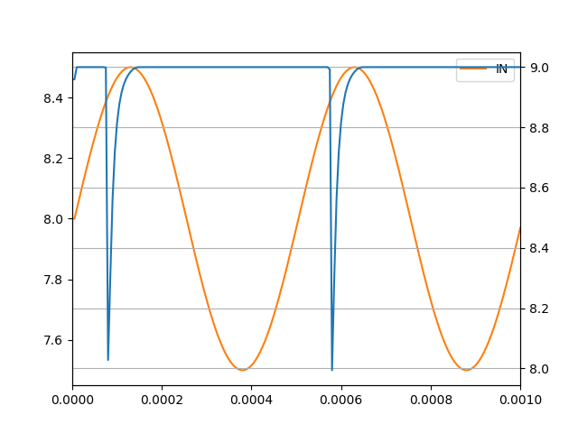
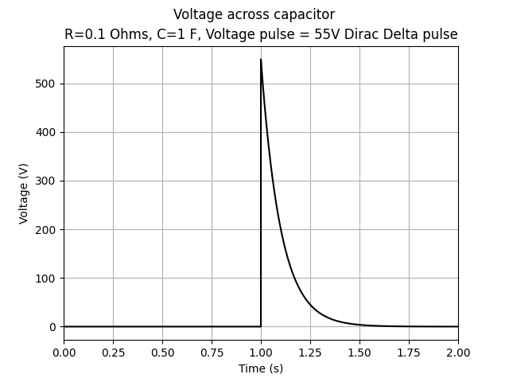

---

# impulso-mna

**impulso-mna** is a Python package for circuit simulation based on **Modified Nodal Analysis (MNA)**. It provides a flexible and extensible framework for DC, AC, and transient analysis of electrical circuits, with a strong focus on clarity, composability, and performance.

The package is installed as `impulso-mna` but imported as:

```python
import impulso
```

---

## ✨ Features

* Modified Nodal Analysis (MNA) core
* Unified framework for:

  * DC operating point analysis
  * AC small-signal analysis
  * Transient simulation
* Support for:

  * Resistors, capacitors, inductors
  * Independent voltage and current sources
  * Nonlinear components (e.g. diodes, BJTs)
* Companion models for transient analysis
* Extensible component API for custom devices
* Designed for readability and experimentation

---

## 📦 Installation

```bash
pip install impulso-mna
```

For development (editable install):

```bash
git clone https://github.com/<your-username>/impulso-mna.git
cd impulso-mna
pip install -e .
```

---

## 🚀 Quick Example

```python
import impulso as imp

# Create a circuit
ckt = imp.Circuit()

# Add components
ckt.add(imp.Resistor("R1", n1=1, n2=0, value=1e3))
ckt.add(imp.VoltageSource("V1", n_plus=1, n_minus=0, value=5.0))

# Solve DC operating point
solution = ckt.solve_dc()

print(solution.node_voltages)
```

---

## 📊 Example Simulations

The repository includes several example simulations demonstrating the capabilities of the library.

### 1. Diode I–V Curve

Simulates the nonlinear current–voltage characteristic of a diode using DC sweep.

* Demonstrates:

  * Nonlinear solving
  * Operating point convergence
* Output: exponential I–V curve



---

### 2. NPN Transistor Output Characteristics

Generates a family of curves (Ic vs Vce) for different base currents.

* Demonstrates:

  * BJT modeling (e.g. Ebers–Moll)
  * Parameter sweeps
* Output: characteristic transistor curves including saturation behavior and output resistance (Early voltage).



---

### 3. Pulse Counting FM Detector

Implements a simple frequency-modulation detector based on pulse counting.

* Demonstrates:

  * Transient simulation
  * Time-domain signal processing
* Output: recovered modulation signal from pulse frequency



---

### 4. Dirac Pulse Driving an RC Network

Applies a Dirac-like pulse to an RC circuit and observes the response.

* Demonstrates:

  * Impulse-like excitation
  * Transient response of linear systems
* Output: exponential decay consistent with RC time constant



---

## 🧠 Design Philosophy

* **Minimal but powerful**: Focus on essential abstractions
* **Explicit stamping**: Components directly contribute to MNA matrices
* **Unified API**: Same interface across DC / AC / transient
* **Extensibility first**: Easy to implement custom components

---

## 🧩 Component Model

Each component contributes to the system via:

* Admittance / conductance
* Current injections
* Additional equations (for voltage sources, inductors, etc.)

Nonlinear components are handled through iterative solving (e.g. Newton-Raphson), with operating point linearization for AC analysis.

---

## 🔧 Development Workflow

Recommended setup:

```bash
pip install -e .[dev]
```

Typical structure:

```
.
├── impulso/
├── examples/
├── tests/
└── pyproject.toml
```

Run examples:

```bash
python examples/diode_curve.py
```

---

## 📈 Performance Notes

* Uses NumPy for linear algebra
* Designed to be efficient but still readable
* Profiling suggests convergence checks can be a bottleneck — optimizations welcome

---

## 🤝 Contributing

Contributions are welcome. Areas of interest include:

* Performance improvements
* Additional device models
* Better convergence strategies
* Documentation and examples

---

## 📄 License

MIT License (or your chosen license)

---

## 🏁 Roadmap

Here’s a revised **Roadmap** section that reflects a stable, maintenance-focused direction:

---

## 🎯 Scope & Philosophy

**impulso-mna** is intentionally designed as a **minimal, foundational implementation of Modified Nodal Analysis (MNA)**.

Its purpose is to provide:

* A clear and correct reference implementation of MNA
* A lightweight engine for DC, AC, and transient simulation
* A clean and predictable API for circuit construction and analysis

The package prioritizes **clarity, stability, and simplicity** over feature breadth. It is deliberately kept:

* Easy to read and reason about
* Easy to extend for custom components and experiments
* Free from heavy abstractions, dependency injection, or complex infrastructure

This makes `impulso-mna` suitable both as a practical simulation tool and as a foundation for understanding and developing circuit solvers.

---

## 🚧 Advanced Features

Advanced functionality is provided in a separate package:

**impulsox-mna** *(planned)*

This package targets more demanding simulation scenarios and may include:

* More sophisticated semiconductor device models (e.g. advanced BJT/MOSFET models)
* Enhanced nonlinear convergence strategies
* Sparse and high-performance numerical backends
* RF and high-frequency analysis tools
* Noise analysis
* Extended simulation workflows and tooling

---

## 🔗 Relationship Between Packages

The two packages are **intentionally independent and self-contained**:

```text id="y3y2y3"
impulso-mna   → minimal, stable, and dependency-light MNA implementation
impulsox-mna  → advanced, feature-rich, fully independent simulator
```

Key design principles:

* **No dependency relationship**: `impulsox-mna` does not depend on `impulso-mna`
* **Parallel design**: both packages follow a similar structure and philosophy
* **Full autonomy**: each package is complete and usable on its own

This separation ensures that:

* `impulso-mna` remains compact, transparent, and stable
* `impulsox-mna` can evolve freely without introducing complexity into the core
* The base package avoids architectural overhead such as dependency injection or layered abstractions

---
## 🏁 Roadmap

**impulso-mna** is intended to remain a **stable and minimal core package**. Its functionality is largely complete and will not significantly expand over time.

Future development will focus on:

* Bug fixes and correctness improvements
* Code quality, readability, and maintainability
* Minor usability enhancements where appropriate

No major new features or architectural changes are planned for this package.

More advanced functionality and experimental features will be developed separately in **`impulsox-mna`**.

---

